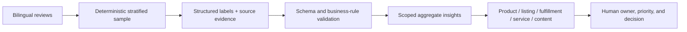

# CrossBorder Voice

[中文](README.md) · [English](README.en.md)

[](https://github.com/zugzwang-zg/crossborder-voice-agent/actions/workflows/ci.yml)
[](https://github.com/zugzwang-zg/crossborder-voice-agent/tree/v0.2.0)
[](https://www.python.org/)
[](LICENSE)

**Turning English and Spanish reviews into scoped, denominator-aware, evidence-linked operating decisions.**

CrossBorder Voice is a bilingual consumer-insight prototype for cross-border ecommerce product, content, and customer-service operations. It turns reviews into filterable pain points, value propositions, and action candidates while preserving sample scope, support counts, and source evidence for human review.

[Live dashboard](https://crossborder-voice-86182.reidmozzie.chatgpt.site) ·
[Product brief](docs/PRODUCT_BRIEF.md) ·
[Insight report](reports/consumer_insights.md) ·
[Decision log](docs/PRODUCT_DECISIONS.md) ·
[Five-minute demo](docs/DEMO_SCRIPT.md) ·
[v0.2.0 notes](docs/RELEASE_NOTES_v0.2.0.md)


## The 60-second case study

| Question | Answer |
|---|---|
| What problem does it solve? | Ratings and generic sentiment do not say what to fix, what to explain, or where the evidence is. The product structures review evidence for operational follow-up. |
| Who is it for? | Cross-border ecommerce product, content, and customer-service operators reviewing multilingual customer feedback. |
| What is the workflow? | Stratified sample → linguistic labels → structured LLM analysis → schema/evidence validation → aggregated insight → human review. |
| What did I own? | This is an individual project. I owned problem framing, scope and priorities, taxonomy, evaluation design, action routing, acceptance, and release. Codex and multiple models supported implementation and independent AI pre-review. |
| What was delivered? | A live dashboard, 15 traceable insights, frozen evaluation, a reproducible pipeline, product documentation, and explicit public/private data boundaries. |

> This is a method-validation portfolio project, not a production deployment. The source data is from 2015–2019 and lacks product identifiers, so the project does not claim current market trends or SKU-level business impact.

## Product choices

- **Start from decisions, not model features.** Product, listing, fulfillment, service, and content actions shaped the taxonomy and output contract.
- **Make uncertainty visible.** Insights expose denominators, support volume, language mix, limitations, and source excerpts.
- **Evaluate iteration on frozen data.** Baseline v1 and Improved v9 use the same model and test set; gains and regressions are both reported.
- **Keep humans accountable.** Models propose action candidates; operators set owners, priority, status, and final decisions.

Case-study materials:

- [Product brief / PRD-lite](docs/PRODUCT_BRIEF.md)
- [Solution landscape](docs/SOLUTION_LANDSCAPE.md)
- [Product decision log](docs/PRODUCT_DECISIONS.md)
- [Consumer insight report](reports/consumer_insights.md)
- [Retrospective](docs/RETROSPECTIVE.md)
- [Project presentation](assets/CrossBorder_Voice_Project_Presentation.pptx)

## Verified outcomes

| Capability | Result | Scope |
|---|---:|---|
| Structured analysis | 1,000 reviews | 500 English / 500 Spanish; 100 per language-rating cell, not a market-share sample |
| Traceable operating insights | 15 | Each retains support records, denominator, language mix, limitations, and evidence |
| Frozen test set | 100 reviews | Separate from prompt-development data |
| Sentiment accuracy | 87% → **89%** | Same model and frozen test set |
| Aspect precision | 72.22% → **83.18%** | Tighter boundaries improved precision with explicit recall trade-offs |
| Human evidence-validity check | 88% → **96%** | Balanced sample of 25 items per version, not full human review |
| v0.2.0 AI pre-review | 15 / 15 pass | Multi-role AI pre-review, not independent human annotation |
| Automated regression | 118 Python + 4 dashboard tests | Core pipeline, release controls, audit, and UI behavior |

## Try it in 30 seconds

Open the [public dashboard](https://crossborder-voice-86182.reidmozzie.chatgpt.site):

1. narrow the sample by language, rating, or sentiment;
2. open an AI Insight and inspect its support volume and limits;
3. return to the linked review excerpts before accepting an action.

The public site uses 10 safe demo records and never calls a paid model API.

## From reviews to actions



Examples from the fixed sample:

- 72 low-rating records support an “insufficient effect” issue; the candidate action is to reduce absolute listing claims and clarify conditions and expected time to effect.
- 38 low-rating records support “delayed or not delivered”; fulfillment should be routed separately from product quality and supported by a service FAQ.
- “Specific needs” has 26 high-rating supporting records, “gifting” 20, and “repurchase” 15.
- Delivery is mentioned in 14% of the Spanish sample and 6% of the English sample; the project does not turn this sample difference into a cultural or country-level causal claim.

See the [full insight report](reports/consumer_insights.md), [evaluation report](reports/evaluation_report.md), and [operational routing rules](docs/OPERATIONAL_ACTION_ROUTING.md).

## Run locally

Node.js 22.13+ and pnpm are required for the dashboard. No API key is needed:

```powershell
cd dashboard
pnpm install --frozen-lockfile
pnpm dev
```

Run the offline regression suite:

```powershell
python -m pip install -r requirements.txt
python -m unittest discover -s tests -q
cd dashboard
pnpm lint
pnpm test
```

For OpenAI-compatible API use, see [API configuration](docs/API_CONFIGURATION.md). Never commit keys, local `.env` files, complete source corpora, row-level model outputs, or private review workbooks.

## Known limits and next validation

- The frozen gold set contains only one `neutral` record; sentiment Macro-F1 is sensitive to minority-class size.
- Long multi-topic reviews and implicit aspects can still be missed.
- No controlled same-batch time study exists, so the project does not claim a specific efficiency gain.
- Recent data with product, marketplace, and timestamp fields is required before SKU or trend decisions are valid.
- The 40-item challenge set still needs two independent human annotators and adjudication.

## Stack and license

Python · JSON Schema · OpenAI-compatible Responses API · Prompt Engineering · Evaluation · Next.js · React · TypeScript · Data Visualization

Licensed under [Apache License 2.0](LICENSE). See [third-party assets](docs/THIRD_PARTY_ASSETS.md) and [data and privacy](docs/DATA_AND_PRIVACY.md) for distribution boundaries.
