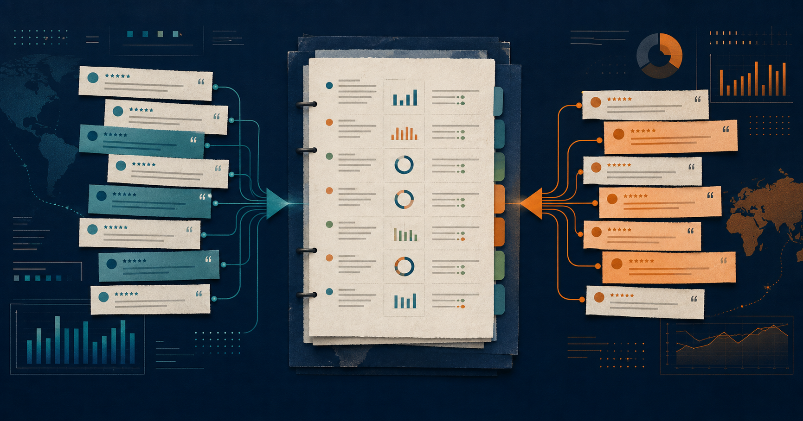
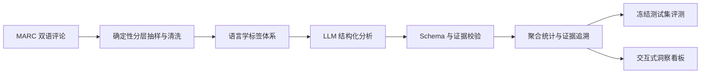

# CrossBorder Voice

[](https://github.com/zugzwang-zg/crossborder-voice-agent/actions/workflows/ci.yml)
[](https://www.python.org/)
[](dashboard/README.md)

[Architecture](docs/ARCHITECTURE.md) · [Five-minute demo](docs/DEMO_SCRIPT.md) · [v0.2.0 readiness](docs/RELEASE_READINESS.md)

**把英语与西班牙语评论转换为有范围、有分母、能回到原文的运营决策。**

面向跨境电商产品、内容与客服运营人员。CrossBorder Voice 将评论整理为可筛选的痛点、卖点和行动建议；当商品字段缺失时，它会明确停留在语料方法演示，不把语言或文本猜成商品、国家或市场事实。



**30 秒体验：** [打开在线 Dashboard](https://crossborder-voice-86182.reidmozzie.chatgpt.site)，进入“AI 洞察报告”，选择一条洞察并打开右侧评论证据。

[技术演示文稿](assets/CrossBorder_Voice_Project_Presentation.pptx) ·
[在线体验](https://crossborder-voice-86182.reidmozzie.chatgpt.site) ·
[模型评测](reports/evaluation_report.md) ·
[消费者洞察](reports/consumer_insights.md) ·
[抽样与范围边界](docs/SAMPLING_AND_SCOPE.md) ·
[数据与隐私](docs/DATA_AND_PRIVACY.md)

| 已验证能力 | 当前结果 | 复现与口径 |
|---|---:|---|
| 正式分析规模 | 1,000 条 | 英语 500 / 西语 500；每个语言 × 星级分层 100 条，[不代表市场占比](docs/SAMPLING_AND_SCOPE.md) |
| 冻结测试集 | 100 条 | 与提示词开发集分离，[查看评测](reports/evaluation_report.md) |
| 人工证据语义有效率 | 96% | 每版本抽查 25 条，不等同于全量复核，[查看方法](reports/evaluation_report.md) |
| 冻结挑战集扩展 | 40 条待双人标注 | 英语 20 / 西班牙语 20，覆盖中性候选、混合候选、长评论、多主题和隐含属性；尚不计入主指标 |
| 自动化回归 | 49 项 Python + 4 项 Dashboard | `python -m unittest discover -s tests -q`；`cd dashboard; pnpm test` |

### 1 分钟本地演示

无需 API Key，公开仓库会回退到 10 条安全样本：

```powershell
cd dashboard
pnpm install --frozen-lockfile
pnpm dev
```

打开 `http://localhost:3000`。如需验证完整核心链路，运行：

```powershell
python -m unittest discover -s tests -q
```

> 数据来自 2015—2019 年，只用于方法验证；当前正式语料缺少商品标识，因此不能提供单品决策或当前市场趋势。

## 问题与目标

星级统计只能说明总体满意度，无法直接回答“产品应改什么、页面应解释什么、结论的证据在哪里”。CrossBorder Voice 将分散的消费者声音整理为结构化证据，帮助运营人员完成筛选、比较与复核，而不替代人的最终判断。

系统重点回答：

- 低星评论中的产品、包装与履约问题是什么；
- 高星评论中的购买动机和可验证卖点是什么；
- 英语与西班牙语样本在关注点和表达方式上有何差异；
- 星级与文本情感何时不一致；
- 每条聚合洞察由哪些评论和原文片段支持。

## 方法



核心约束：

- 严格 JSON Schema：不合规输出不进入聚合；
- 最小充分证据：标签必须绑定评论原文片段；
- 自动重试与断点续跑：网络中断后可补跑缺失记录；
- 标签规范化：拦截不支持的标签、逻辑冲突和越界建议；
- 洞察可追溯：保留支持量、语言分布、评论 ID 和代表性证据。

详细设计见 [AI pipeline](docs/AI_PIPELINE.md)、[insight methodology](docs/INSIGHT_METHODOLOGY.md) 与 [annotation guideline](annotation_guideline.md)。

## 标签体系

系统同时描述“说了什么、如何评价、为什么购买、在什么语境下表达”：

| 维度 | 作用 | 示例 |
|---|---|---|
| 整体情感与强度 | 区分 positive / negative / neutral / mixed / uncertain | 五星但尚未使用可标为 uncertain |
| 产品属性 | 识别评价对象 | 效果、气味、质地、易用性、耐用性 |
| 具体问题 | 将属性评价细化为可处理问题 | 效果不足、难以使用、延迟未送达 |
| 购买动机 | 识别购买与复购驱动 | 特定需求、送礼、价格、推荐 |
| 使用场景与状态 | 控制推断边界 | 日常护理、旅行、尚未使用 |
| 预期落差 | 判断实际体验与预期的差异 | 描述承诺与实际效果不一致 |
| 言语行为 | 捕捉语用功能 | 推荐、警告、抱怨、请求、建议 |
| 原文证据 | 支持人工复核 | 对应标签的最小原文片段 |

## 评测结果

100 条独立人工标注评论组成冻结测试集（英语 50 / 西班牙语 50）。Baseline v1 与 Improved v9 使用相同模型和相同测试集。

| 指标 | Baseline v1 | Improved v9 |
|---|---:|---:|
| JSON 解析成功率 | 100% | **100%** |
| 情感分类 Accuracy | 87% | **89%** |
| 情感 Macro-F1 | 65.61% | **67.15%** |
| 属性识别 Precision | 72.22% | **83.18%** |
| 属性识别 F1 | 67.47% | **74.02%** |
| 具体问题 F1 | 72.56% | **74.86%** |
| 人工证据语义有效率 | 88% | **96%** |

人工证据指标来自每个版本 25 条、英西语均衡的语义抽查，不代表对全部证据逐条人工复核。完整指标、误差分析和评测口径见 [evaluation report](reports/evaluation_report.md)。

模型输出的 `confidence` 当前只作为模型自报分数展示，不解释为“预测正确概率”。冻结评测现同时报告情感逐类 Precision / Recall / F1、Macro-F1、混淆矩阵，属性与问题的 Micro / Macro 指标，以及置信度校准误差。另有 40 条挑战输入已冻结，须完成双人独立标注与仲裁后才可进入独立挑战集指标，流程见 [frozen challenge set](docs/FROZEN_CHALLENGE_SET.md)。

## 洞察示例

正式分析生成 15 条可追溯洞察：

- “效果不足”有 72 条低星支持评论；详情页应降低绝对化承诺，并补充适用条件与预期周期；
- “延迟或未送达”有 38 条低星支持评论；履约问题应与产品问题分流，并建立客服 FAQ；
- 高星评论中，“特定人群需求”有 26 条支持，“送礼”有 20 条支持，“复购”有 15 条支持；
- 西班牙语样本中的配送提及率为 14%，英语样本为 6%；该差异只描述当前分层样本，不作文化因果解释。

完整洞察见 [consumer insights](reports/consumer_insights.md)。

## 仓库结构

```text
crossborder-voice/
├── config/          # 流水线与评测配置
├── data/
│   ├── sample/      # 可公开的最小演示样本
│   └── aggregated/  # 不含完整评论原文的汇总表
├── prompts/         # v1—v9 提示词迭代
├── src/             # Schema、LLM 分析、聚合与评测
├── scripts/         # 数据准备、评测与演示数据生成
├── notebooks/       # 清洗、EDA 与评测复现入口
├── tests/           # Python 测试
├── dashboard/       # Next.js / React 洞察看板
├── reports/         # 洞察、评测与误差分析
└── assets/          # 技术演示文稿、讲解指南与截图
```

完整原始语料、金标数据、模型逐条输出、API 日志和人工复核工作簿不进入公开仓库。详见 [public data policy](data/PUBLIC_DATA_POLICY.md)。

## 本地运行

### Python 核心链路

要求 Python 3.11+。

```powershell
python -m venv .venv
.\.venv\Scripts\Activate.ps1
python -m pip install -r requirements.txt
python -m unittest discover -s tests -q
```

不调用付费 API 的离线烟雾测试：

```powershell
python -m src.llm_analyzer `
  --provider mock `
  --input data/sample/demo_reviews.csv `
  --output data/sample/mock_predictions.jsonl `
  --errors data/sample/mock_errors.jsonl `
  --run-log data/sample/mock_run.json `
  --no-resume
```

使用 OpenAI-compatible API 时，请参考 [API configuration](docs/API_CONFIGURATION.md)。不要提交密钥或本地 `.env`。

聚合已验证的正式结果：

```powershell
python scripts/aggregate_insights.py
```

### 交互式看板

无需安装或配置 API key，可直接打开[公开演示网页](https://crossborder-voice-86182.reidmozzie.chatgpt.site)。网页默认使用 10 条安全演示样本，不会调用付费模型 API。

要求 Node.js 22.13+ 与 pnpm。

```powershell
cd dashboard
pnpm install
pnpm lint
pnpm test
pnpm dev
```

公开仓库默认加载 10 条安全演示样本；本地存在完整数据包时可加载 1,000 条正式分析结果。

## 已知限制

- `neutral` 金标仅 1 条，情感 Macro-F1 受小类样本量影响；
- 多主题长评论与隐含属性仍可能漏召回；
- 更保守的标签边界提高了 Precision，但属性 Recall 仍有改进空间；
- 时间节省率、实际中转服务成本和人工/AI 洞察覆盖率尚未完成同批对照实验；
- 业务建议必须结合当前产品、站点和市场数据二次验证。

## 技术栈

Python · JSON Schema · OpenAI-compatible Responses API · Prompt Engineering · Human Evaluation · Next.js · React · TypeScript · Data Visualization
