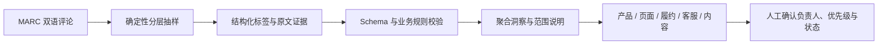

# CrossBorder Voice

[中文](README.md) · [English](README.en.md)

[](https://github.com/zugzwang-zg/crossborder-voice-agent/actions/workflows/ci.yml)
[](https://github.com/zugzwang-zg/crossborder-voice-agent/tree/v0.2.0)
[](https://www.python.org/)
[](LICENSE)

**把英语与西班牙语评论转换为有范围、有分母、能回到原文的跨境运营决策。**

CrossBorder Voice 是一个面向跨境电商产品、内容与客服运营的双语消费者洞察原型。它不止判断正负面，而是把评论整理为可筛选的痛点、卖点和行动候选，并保留支持量、样本范围与原文证据，方便运营人员复核后再决策。

[免费上传试用](https://crossborder-voice-86182.reidmozzie.chatgpt.site) ·
[产品简报](docs/PRODUCT_BRIEF.md) ·
[运营洞察报告](reports/consumer_insights.md) ·
[产品决策日志](docs/PRODUCT_DECISIONS.md) ·
[五分钟演示](docs/DEMO_SCRIPT.md) ·
[v0.2.0 发布说明](docs/RELEASE_NOTES_v0.2.0.md)


## 给招聘方的 60 秒导览

| 面试官关心的问题 | 本项目的回答 |
|---|---|
| 解决什么问题？ | 星级统计无法直接回答“产品应改什么、页面应解释什么、证据在哪里”；系统把分散评论转成可复核的运营洞察。 |
| 谁会使用？ | 跨境电商产品运营、内容运营和客服运营；在上新复盘、详情页优化、FAQ 分流和本地化研究中使用。 |
| 产品如何工作？ | 双语分层抽样 → 语言学标签 → LLM 结构化分析 → Schema/证据校验 → 洞察聚合 → 人工复核看板。 |
| 我的贡献是什么？ | 个人项目；负责问题定义、范围与优先级、标签体系、评测口径、运营动作路由、验收和发布。Codex 与多个模型用于实现和独立 AI 预评审，所有结论仍由维护者验收。 |
| 最终交付了什么？ | 可运行 Dashboard、15 条可追溯洞察、冻结评测、可复现流水线、产品与方法文档，以及公开/私有数据边界。 |

> 这是方法验证型作品，不是生产系统。数据来自 2015—2019 年，正式语料缺少商品标识；因此项目不声称代表当前市场趋势，也不输出单品级经营结论。

## 产品思维如何落到实现

- **先定义决策，再选择模型：** 从“详情页、产品、履约、客服、内容”五类运营动作反推标签与输出结构，而不是从通用情感分析开始堆功能。
- **把不确定性做成产品能力：** 每条洞察展示分母、支持量、语言分布、限制和原文证据；数据不支持时明确停止推断。
- **用评测推动迭代：** 在同一冻结测试集上比较 Baseline v1 与 Improved v9，并记录 Precision/Recall 的取舍，而不是只展示效果最好的案例。
- **保留人工决策权：** 模型给出行动候选，运营人员负责确认负责人、优先级和执行状态；反馈日志不覆盖原始模型输出。

完整案例材料：

- [产品简报 / PRD-lite](docs/PRODUCT_BRIEF.md)：用户、JTBD、范围、验收标准与成功指标；
- [方案对比](docs/SOLUTION_LANDSCAPE.md)：人工表格、通用 LLM、VOC 平台与本方案的取舍；
- [产品决策日志](docs/PRODUCT_DECISIONS.md)：关键方案、放弃项、风险与结果；
- [运营洞察报告](reports/consumer_insights.md)：15 条证据绑定的行动候选；
- [项目复盘](docs/RETROSPECTIVE.md)：已验证结果、失败与下一阶段计划；
- [技术演示文稿](assets/CrossBorder_Voice_Project_Presentation.pptx)：完整项目讲解材料。

## 已验证结果

| 能力 | 当前结果 | 口径与证据 |
|---|---:|---|
| 正式分析规模 | 1,000 条 | 英语 500 / 西语 500；每个“语言 × 星级”分层 100 条，[不代表市场占比](docs/SAMPLING_AND_SCOPE.md) |
| 可追溯运营洞察 | 15 条 | 每条保留支持记录、分母、语言分布、限制和代表性证据 |
| 冻结测试集 | 100 条 | 与提示词开发集分离，[查看评测](reports/evaluation_report.md) |
| 情感 Accuracy | 87% → **89%** | Baseline v1 与 Improved v9 使用相同模型、相同测试集 |
| 属性 Precision | 72.22% → **83.18%** | 更严格的标签边界提高 Precision，同时保留 Recall 限制 |
| 人工证据语义有效率 | 88% → **96%** | 每版本抽查 25 条，不等同于全量人工复核 |
| v0.2.0 AI 预评审 | 15 / 15 pass | 多角色独立 AI 预评审；不能替代独立人类标注，[查看公开证明](reports/ai_review_attestation.json) |
| 自动化回归 | 118 Python + 4 Dashboard | 核心链路、发布清单、审计与 UI 行为测试 |

## 30 秒免费试用

打开[公开网页](https://crossborder-voice-86182.reidmozzie.chatgpt.site)，可以直接：

1. 下载 CSV 模板并粘贴自己的英语/西班牙语评论；
2. 上传 CSV、TSV 或 XLSX 表格，自动查看高频问题、反馈方向和下一步建议；
3. 下载带快速判断和主题的分析结果，或继续浏览完整项目演示。

文件只在当前浏览器中读取，不上传服务器，也不调用付费模型 API。单次支持 500 行、5MB；快速结果用于初筛，仍需人工复核。完整项目演示路径见[五分钟演示脚本](docs/DEMO_SCRIPT.md)。

## 从评论到运营动作



代表性发现（仅描述当前分层样本）：

- “效果不足”由 72 条低星记录支持；行动候选是降低详情页绝对化承诺，并补充适用条件和预期周期；
- “延迟或未送达”由 38 条低星记录支持；行动候选是将履约问题与产品问题分流，并建立客服 FAQ；
- 高星评论中，“特定人群需求”有 26 条支持，“送礼”有 20 条支持，“复购”有 15 条支持；
- 西语样本的配送提及率为 14%，英语样本为 6%；该差异不被解释为国家或文化因果。

完整证据、分母与限制见[消费者洞察报告](reports/consumer_insights.md)和[行动路由规则](docs/OPERATIONAL_ACTION_ROUTING.md)。

## 评测与边界

| 指标 | Baseline v1 | Improved v9 |
|---|---:|---:|
| JSON 解析成功率 | 100% | **100%** |
| 情感分类 Accuracy | 87% | **89%** |
| 情感 Macro-F1 | 65.61% | **67.15%** |
| 属性识别 Precision | 72.22% | **83.18%** |
| 属性识别 F1 | 67.47% | **74.02%** |
| 具体问题 F1 | 72.56% | **74.86%** |
| 人工证据语义有效率 | 88% | **96%** |

模型输出的 `confidence` 只作为模型自报分数，不解释为正确概率。另有 40 条挑战输入已冻结，只有在双人独立标注与仲裁完成后才会计入独立挑战集指标。完整口径见[模型评测](reports/evaluation_report.md)与[冻结挑战集说明](docs/FROZEN_CHALLENGE_SET.md)。

## 一分钟本地演示

要求 Node.js 22.13+ 与 pnpm。无需 API Key：

```powershell
cd dashboard
pnpm install --frozen-lockfile
pnpm dev
```

打开 `http://localhost:3000`。运行完整离线回归：

```powershell
python -m pip install -r requirements.txt
python -m unittest discover -s tests -q
cd dashboard
pnpm lint
pnpm test
```

如需运行不调用付费 API 的核心烟雾测试：

```powershell
python -m src.llm_analyzer `
  --provider mock `
  --input data/sample/demo_reviews.csv `
  --output data/sample/mock_predictions.jsonl `
  --errors data/sample/mock_errors.jsonl `
  --run-log data/sample/mock_run.json `
  --no-resume
```

使用 OpenAI-compatible API 时见 [API 配置](docs/API_CONFIGURATION.md)。不要提交密钥、本地 `.env`、完整原始语料、模型逐条输出或人工复核工作簿。

## 仓库导航

```text
crossborder-voice/
├── config/          # 流水线、评测与 AI 预评审配置
├── data/sample/     # 可公开的最小演示样本
├── prompts/         # v1—v9 提示词迭代
├── src/             # Schema、分析、聚合与评测
├── scripts/         # 数据准备、评测与演示数据生成
├── tests/           # Python 回归测试
├── dashboard/       # Next.js / React 交互看板
├── reports/         # 评测、误差分析与消费者洞察
├── docs/            # 产品、方法、隐私、发布与复盘文档
└── assets/          # 演示文稿与界面截图
```

## 已知限制与下一步

- `neutral` 金标只有 1 条，情感 Macro-F1 受小类样本量影响；
- 多主题长评论与隐含属性仍可能漏召回；
- 尚未完成同批人工分析与 AI 辅助分析的耗时/覆盖率对照，因此不声称节省了具体百分比；
- 下一阶段需要接入带商品、站点和时间字段的近期数据，再验证单品决策与趋势价值；
- 冻结挑战集仍需两名独立人工标注者完成标注和仲裁。

## 技术栈与许可

Python · JSON Schema · OpenAI-compatible Responses API · Prompt Engineering · Evaluation · Next.js · React · TypeScript · Data Visualization

本项目采用 [Apache License 2.0](LICENSE)。数据、依赖、字体、媒体与模型服务边界见[第三方资产清单](docs/THIRD_PARTY_ASSETS.md)和[数据与隐私说明](docs/DATA_AND_PRIVACY.md)。
